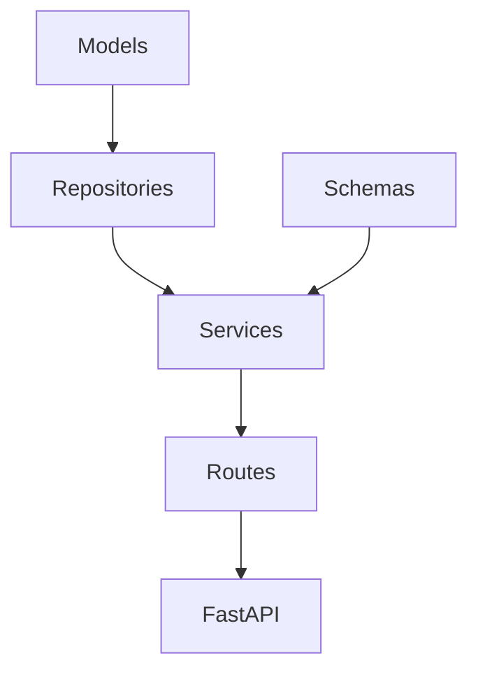

# 💳 CredCrud
## Microsserviço de cadastro de cartões de crédito simples - pun intended 😅
[](https://codecov.io/gh/joepreludian/credcrud)

Este projeto será montado apenas para fins de estudo. O mesmo trabalhará em cima do FastAPI e utilizando boas práticas.

## 🧭 Requisitos técnicos
* Será necessário cadastrar os dados do cartão;
* Faz-se necessário a utilização da biblioteca [MaisTodos/python-creditcard]( https://github.com/MaisTodos/python-creditcard) para a validação da numeração do cartão.
  * Vale ressaltar que se faz necessário a configuração dos outros dados, como Data de expiração, CVV, etc.
* O dado da numeração do cartão precisa estar criptografado.
* A API precisa estar protegida por meio de credenciais.

# 🛠️ Estratégia de trabalho
Para o desafio acima proposto, será adotado o microframework FastAPI e como persistencia de dados será utilizado SQLAlchemy com Alembic. Como possuo pouco tempo disponível para o projeto, tentarei fazer tradeoffs de modo a não ter prejuízo no desenvolvimento.

Criei [um arquivo de log](CHANGELOG.md) onde eu descreverei o conjunto de ações tomadas de modo a chegar no objetivo final.

## 🧪 Execução
Para o desafio proposto me dispus de uma arquitetura multi-camada onde eu conseguia controlar a aplicação encapsulada em classes que me permitiam controlar certos aspectos da lógica de negócio. Por exemplo, estruturei a aplicação em algumas estruturas abaixo descritas:

### 🟢 Models
Entidade do SQLAlchemy onde eu armazenaria o dado no banco de dados

### 🟢 Repositories
Classe responsável por manipular o SQLAlchemy; Seria como os `managers` do Django. Aqui é onde eu posso solicitar um Card By ID, ou criar um card, etc etc.

### 🟢 Schemas
Aqui é onde a validação ocorre. Criei três representações do dado do Card que são as portas com a camada de serviço e o mundo externo. Basicamente temos 3 classes principais
* `Card` -> Classe principal, *source of truth*, onde eu crio o objeto do `Card` em si. Transforma o campo data de vencimento em um objeto datetime, e possui métodos para interpretar dados vindos do Model do SQLAlchemy, assim como os modelos a seguir.
* `CardPayload` -> É o tipo de dado que eu espero receber quando crio um novo card. Virá no formato descrito abaixo e visa realizar checagens prévias, como a data de vencimento do cartão para evitar cadastrar um cartão vencido.
* `RedactedCardPayload` -> É herdado de `CardPayload`. Transforma o dado de modo a ocultar dados sensíveis do cartão. Parte-se da premissa que um cartão, depois que ele é adicionado, não necessita de uma visualização dos dados salvo para conferencia. Seguindo boas práticas, exibo apenas os últimos digitos do cartão , por exemplo. Aqui também coloco o campo `brand` se o mesmo for detectado pela library python, assim como seu ID, caso venha do banco de dados.

### 🟢 Services
Area onde eu vou conectar os Schemas com os Repositórios. Aqui também que eu farei a injeção da sessão do banco, responsável pela manipulação dos dados.

### 🟢 Routes
As rotas, em Si, onde eu opero a camada de borda do sistema com o mundo real. Ele apenas é um Adaptador do da minha camada de Serviço

Ou seja, a ordem proposta dos serviços fica mais ou menos assim:



## ⚠️ Tradeoffs
Infelizmente me puz um certo tempo para a entrega do desafio, o que me forçou a priorizar o que eu achei mais importante no projeto, e deixar as partes menos vitais para explicar como faria aqui. Mas acredito que o que tenho dá pra voces terem uma noção das minhas capacidades técnicas.

|     | Recurso                                            | TradeOff                                                                                                                                                                                                                               | Possivel melhoria                                                                                                                                                                                                                                                                                              |
|-----|----------------------------------------------------|----------------------------------------------------------------------------------------------------------------------------------------------------------------------------------------------------------------------------------------|----------------------------------------------------------------------------------------------------------------------------------------------------------------------------------------------------------------------------------------------------------------------------------------------------------------|
| ⚠️  | Chamadas autenticadas - autorização e autenticação | Nesse caso optei por criar apenas um handler simples que avalia se estou autenticado.                                                                                                                                                  | Trabalhar em um sistema completo com autorização e autenticação multiusuário ou eventualmente utilizar um serviço de terceiros                                                                                                                                                                                 |
| ⚠️  | Documentação OpenAPI Completa                      | Nesse caso eu optei por deixar as configurações padrão mesmo, separando melhor o tempo para focar nas áreas mais trabalhosas.                                                                                                          | Criar todas as rotas e definir os esquemas de segurança de maneira a refletir corretamente no Swagger/OpenAPI                                                                                                                                                                                                  |
| ⚠️  | Simplificação do banco de dados                    | Como estava utilizando o SQLAlchemy eu optei por fazer o máximo de simplificações, focando apenas na entidade Card, não me preocupando com vinculá-lo a um usuário nem seguir nesse sentido pois aumentaria a complexidade da solução. | Criar modelos para a auth, vincular o usuário logado ao Card especifico.                                                                                                                                                                                                                                       |
| ⚠️  | Simplificado validações do CardSchema              | Nesse caso me assegurei de cobrir alguns poucos exemplos que acredito que sejam suficientes para o desafio. Tentei focar na dinâmica da entrega como um todo.                                                                          | Não seria um problema grande, pois tratar-se-ia apenas de investigar os edge cases e trabalhar neles de modo a cobrir eventuais problemas. Eventualmente adicionar bibliotecas de teste auxiliares, como `faker` para Python, onde conseguiríamos criar uma massa de dados bem mais interessante, por exemplo. |

## 🚀 Executando o projeto
Esse projeto precisa ser instalado antes de sua execução propriamente dita. Isto ocorre porque o banco de dados precisa ser criado corretamente antes do uso. Para isso, rode o seguinte comando (necessário apenas a primeira vez)
Estou assumindo que voce possua `Docker` e `Docker Compose` instalados na sua máquina antes de executar os comandos abaixo.

    $ make setup

Para rodar o projeto basta executar o seguinte comando abaixo:

    $ make run

Este comando irá iniciar o FastAPI. Para acessar o serviço basta acessar o link http://127.0.0.1:8765 e começar a realizar suas chamadas de API.

Como referencia, criei um arquivo de exemplo de requisições para que voce possa testar voce mesmo. 🔎 [apitest.http](apitest.http).

Caso queira voce pode também consultar o Swagger gerado pelo projeto. Antes fique ciente das limitações na seção "Tradeoffs" desse documento antes de consumir este. http://127.0.0.1:8765/docs

**💡Dica**: Para gerar números de cartão de crédito validos voce pode usar um gerador online: https://www.creditcardvalidator.org/generator

## 🧯 Testando o projeto
Esse software foi concebido utilizando boas práticas de código com foco no desenvolvimento de testes desde sua concepção. A estratégia foi simples: ao passo que eu projetava a funcionalidade, já codificava um teste para validar se o código estava se comportando corretamente. Como um extra, adicionei cobertura de testes para o processo, o que viabilizou entender corretamente as áreas que eu precisava cobrir. O mapa da cobertura de testes está apresentada abaixo:


### ⚙️ Entendendo o gráfico acima
Cada bloco representa um único arquivo no projeto. O tamanho e a cor de cada bloco são representados pelo número de linhas e pela cobertura, respectivamente.
Quanto mais verde, mais coberto. Quanto mais vermelho, menos coberto.

Para executar os testes, basta executar o seguinte código:

    $ make tests

Ao término voce deverá ver algo assim:

```text
(... saída da instalação de algumas libs para executar os testes ...)
+ pytest --cov=credcrud --cov-report xml:coverage.xml --cov-report term
==================================== test session starts ====================================
platform linux -- Python 3.12.0, pytest-7.4.3, pluggy-1.3.0
rootdir: /app
plugins: sqlalchemy-0.2.1, cov-4.1.0, anyio-3.7.1
collected 42 items

tests/functional_tests/test_api.py ....................                               [ 47%]
tests/unit_tests/test_card_repository.py .....                                        [ 59%]
tests/unit_tests/test_card_schema.py .............                                    [ 90%]
tests/unit_tests/test_card_service.py ....                                            [100%]

---------- coverage: platform linux, python 3.12.0-final-0 -----------
Name                            Stmts   Miss  Cover
---------------------------------------------------
credcrud/__init__.py                0      0   100%
credcrud/auth/__init__.py           0      0   100%
credcrud/auth/handler.py           10      0   100%
credcrud/card/__init__.py           0      0   100%
credcrud/card/constants.py          8      0   100%
credcrud/card/exceptions.py         6      0   100%
credcrud/card/models.py            11      0   100%
credcrud/card/repositories.py      37      1    97%
credcrud/card/routes.py            37      1    97%
credcrud/card/schemas.py           64      0   100%
credcrud/card/services.py          19      0   100%
credcrud/card/utils.py              7      0   100%
credcrud/database.py               17      4    76%
credcrud/main.py                    9      0   100%
---------------------------------------------------
TOTAL                             225      6    97%
Coverage XML written to file coverage.xml


==================================== 42 passed in 1.19s =====================================
```


Os testes foram divididos em duas seções: `unitários` e `funcionais`.
Basicamente os testes unitários verificam cada componente do código individualmente. Os testes funcionais por sua vez simulam o funcionamento de todos os componentes em conjunto. A melhor abordagem para isto é realiza-los por meio do teste dos endpoints em si.

**ℹ️ OBSERVAÇÃO**: Tecnicamente testar a camada de serviço seria considerado um teste funcional e estes funcionais, em si, seria meio que um e2e.

### 🔎 Executando o pre-commit no seu projeto
Para instalar o pré-commit no seu projeto irei presumir que voce possui um interpretador python 3.12 instalado na sua máquina e o comando `poetry` disponível. Também irei assumir que voce já clonou esse repositório localmente. =)
Para rodar instalar as dependencias do projeto internamente e executar o pre-commit no código base, faça:

    $ poetry install --with dev
    $ pre-commit run --all-files

A saída do comando será algo mais ou menos assim:

```text
$ pre-commit run --all-files
trim trailing whitespace.................................................Passed
fix end of files.........................................................Passed
bandit...................................................................Passed
black....................................................................Passed
isort (python)...........................................................Passed
autoflake................................................................Passed
flake8...................................................................Passed
```

## 🫡 Humanos e considerações finais
O projeto foi bem divertido de fazer, apesar de trabalhoso. Acredito que seja possível mostrar um pouco mais de minhas habilidades técnicas para voces. Espero que gostem.

* Jon Trigueiro - [jon.dev.br](https://jon.dev.br)
